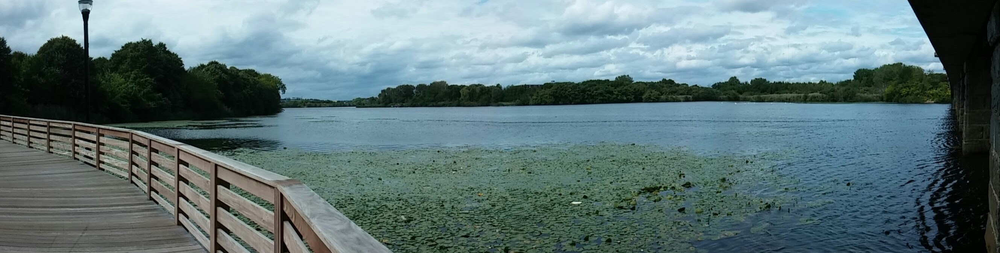

# {{ site.data.site_config.site_abbrev }}: {{ site.data.site_config.site_title }}

The {{ site.data.site_config.site_title }} ({{ site.data.site_config.site_abbrev }}) is a collection of environmental regulatory data and analysis focused on enhancing the use of evidence and accountability for water policy in Massachusetts.

## Integrated

{{ site.data.site_config.site_abbrev }} unifies information from a variety of governmental and public sources into an [integrated database]({{ site.url }}{{ site.baseurl }}/data/index.html) that is permanently archived at this site.  You can even <a href="data/sql_demo.html">query the database</a> directly in your browser.

## Open access

All data, code for data gathering and cleaning, code for analysis, and web development associated with {{ site.data.site_config.site_abbrev }} is completely open source and free to access from this site and our associated [GitHub repository]({{ site.data.site_config.github_link }}).  The data is collected from official government and other public domain sources.

## Datasets

{{ site.data.site_config.site_abbrev }} includes a [constantly-growing list of datasets]({{ site.url }}{{ site.baseurl }}/data/index.html) such as:

* MA environmental agency budgets (DEP, DCR, EEA; FY2001–present)
* MA DEP staffing records
* MA DEP/EEA enforcement actions (1996–present)
* MA combined sewer overflow (CSO) discharge incidents (2022–present)
* MA municipal stormwater (MS4) annual compliance reports (FY2019–present)
* MA lobbying disclosures — bills, employers, spending (2005–present)
* MA Legislature bill text and passage status (GC183–194)
* EPA 303(d) impaired waters (MassGIS, biennial 2010–2022)
* EPA Region 1 NPDES permits
* EPA EJScreen environmental justice indicators (2017, 2023)
* US Census population and income estimates
* NOAA daily precipitation (Massachusetts)
* ECOS state environmental agency budget survey (FY2009–2023)

## Analysis

Through a series of [living analysis documents]({{ site.url }}{{ site.baseurl }}/posts.html) that help readers explore, interpret, and add context to the {{ site.data.site_config.site_abbrev }} data archive, this site is meant to enable and promote further analysis of the environmental protection and regulatory policy in Massachusetts.

{{ site.data.site_config.site_abbrev }} also provides a [dashboard]({{ site.url }}{{ site.baseurl }}/dashboard.html) of up to date, interactive graphics of key environmental data and an [Ask AMEND AI]({{ site.url }}{{ site.baseurl }}/ai_analysis.html) tool to automatically perform analysis and generate data visualizations based on your queries.