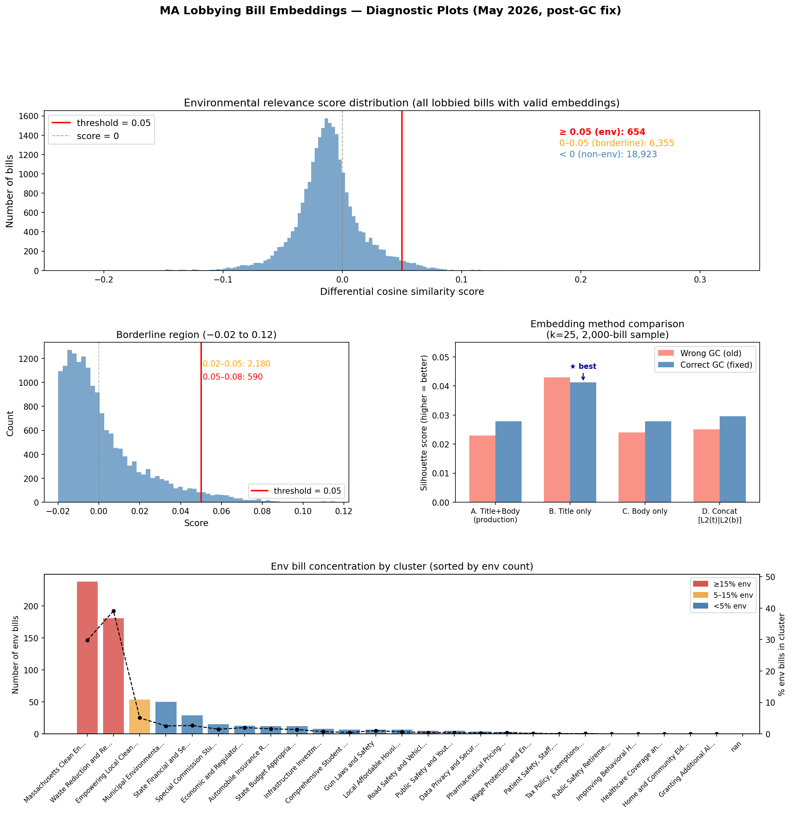

# Bill Embedding and Clustering — Design Notes

## Current approach (as of May 2026)

**Model:** Google Gemini `gemini-embedding-2`, 768-dimensional output.

**Text preparation per bill:**
1. Strip legislative scaffolding from body text using `_SCAFFOLD_RE` — the repeated "Chapter X of the General Laws…is hereby amended by inserting after…" boilerplate that appears identically in thousands of bills regardless of topic.
2. Prepend the bill title (always specific and clean signal).
3. Truncate the combined string to 3,000 characters (~750 tokens).
4. Fall back to title alone when no body text is available.

Bills from GC 183–184 (2005–2008) frequently have no full text in the Legislature API and embed as near-zero vectors; these are excluded from clustering (`cluster_id = -1`).

**Clustering:** K-means, k=25, on L2-normalised (cosine-space) embeddings.
Cluster labels generated by Gemini 2.5 Flash from the 20 most central bill titles per cluster.

**Environmental scoring:** Differential cosine similarity — max cosine similarity to 42 known env bills minus max cosine similarity to 42 known non-env bills. Threshold: 0.05. Results in ~329 flagged bills (~1.3% of all uniquely lobbied bills with valid embeddings).

### Parquet schema note

The `full_text` column in `MA_bill_embeddings.parquet` stores the **constructed embed text** (SoS title prepended to the stripped legislature body), not the raw legislature API text. The docstring in `score_lobbying_bills.py` is incorrect on this point (says "from MA Legislature API"). See line 408–410 of that file.

---

## ⚠️ Data integrity issue: wrong General Court in Legislature API lookups

### Root cause: off-by-one bug in `_year_to_general_court`

`get_MA_lobbying.py` computes `general_court = 183 + (year - 2005) // 2`. This is wrong: the 183rd General Court convened in **January 2003**, not 2005. The correct formula is `183 + (year - 2003) // 2`. The result is that every bill lookup since the scraper was written has been sent to the wrong legislative session — one GC too early.

Correct mapping (GC183 = 2003–2004):

| Year filed | Wrong GC (bug) | Correct GC |
|-----------|---------------|-----------|
| 2005–2006 | GC183 | **GC184** |
| 2009–2010 | GC185 | **GC186** |
| 2013–2014 | GC187 | **GC188** |
| 2021–2022 | GC191 | **GC192** |
| 2023–2024 | GC192 | **GC193** |
| 2025–2026 | GC193 | **GC194** |

**Confirmed experimentally:** `H3111` year=2024 with wrong GC (192) returns "An Act relative to the open meeting law". With correct GC (193) returns "An Act relative to DCR skating rinks" — matching the SoS title exactly. Verified for 5+ additional bills.

**Scale of impact (60-bill random sample with live API checks):**

| GC version | Title match rate |
|-----------|-----------------|
| Wrong GC (bug) | 2% (1/60) |
| **Corrected GC (+1)** | **65% (39/60)** |
| Still wrong after fix | 35% (21/60) |

The corrected GC raises the match rate from ~2% to ~65%. The remaining 35% of mismatches split into:
1. **String normalisation:** SoS sometimes prefixes the bill number to the title (e.g., "H. 2324, An Act relative to residency" vs API "An Act relative to residency") — the bill is the same but the string comparison fails
2. **Cross-session lobbying:** a small number of lobbyists file disclosures in year X for bills introduced in the following session (GC+2 from the wrong formula, not just +1)
3. **Wrong numbers in SoS portal:** a residual fraction where the lobbyist recorded an incorrect bill number; no GC adjustment recovers these

This bug also affects the `general_court` column in `MA_lobbying_bills.csv` — all session assignments are wrong by one GC throughout the corpus.

### Fix

In `get_MA_lobbying.py`, change:
```python
FIRST_GC_START_YEAR = 2005
```
to:
```python
FIRST_GC_START_YEAR = 2003
```

Then re-run the full pipeline: `get_MA_lobbying.py` → `get_MA_legislature_bills.py` → `score_lobbying_bills.py --reembed` → `cluster_lobbying_bills.py` → `assemble_db.py`.

The legislature API cache files are named `bill_{gc}_{bill_id}.json` using the wrong GC, so the corrected lookups will mostly be cache misses and re-fetch from the API. Estimated re-fetch time: ~3–4 hours for ~25,000 bills at 1 req/s.

Also update `CLAUDE.md`: the note "GC 183 = 2005–2006" is wrong; it should read "GC 183 = 2003–2004, GC 184 = 2005–2006".

### Impact on embeddings and scoring

With wrong GC, the legislature body text belongs to a completely different bill ~98% of the time. The bill **title** (from the SoS portal, stored in `bill_title`) is always correct regardless of the GC bug.

**This is why title-only embeddings significantly outperform title+body embeddings** (silhouette 0.043 vs 0.023 — see comparison below): the body text is nearly pure noise under the wrong-GC regime. After fixing the GC bug and re-embedding with correct body text, the title+body method improved from 0.023 → 0.028 (+21%), but title-only remained best at 0.041 — a ~48% lead. Body text still dilutes topic signal even when it belongs to the correct bill, due to structural boilerplate in MA legislative language.

---

## Embedding space structure

MA legislative bill embeddings are **semantically dense** — even after boilerplate stripping, bills cluster tightly regardless of topic because they share heavy structural language.

Empirical measurements (May 2026, 24,612 valid bills after mean-centering + L2 normalisation):

| Metric | Value |
|--------|-------|
| Mean inter-cluster cosine distance (k=25) | ~0.006 |
| Mean intra-cluster cosine spread | ~0.53 |
| Ratio (separation / spread) | ~0.011 |

For comparison, a well-separated topic model typically has inter/intra ratios >0.5. The dense structure is likely partly an artifact of the body-text mismatch problem (body text is unrelated to bill topic).

---

## Embedding method comparison (2,000-bill sample, k=25)

Tested twice: once with **wrong GC** (body text is ~98% from unrelated bills) and again after the GC fix with **correct body text**. Same 2,000-bill sample each time.

### Wrong GC (body = unrelated bills ~98% of the time)

| Method | Silhouette↑ | DB↓ | Notes |
|--------|-------------|-----|-------|
| A. Original (SoS title + API body combined) | 0.023 | 4.76 | Current production method at time of test |
| B. **Title only (SoS)** | **0.043** | **3.71** | Best; 2× silhouette improvement |
| C. Body only (API) | 0.024 | 4.61 | Nearly as bad as combined |
| D. Concat [L2(title) \| L2(body)] | 0.025 | 4.76 | No improvement over original |

### Correct GC (body text matches the actual lobbied bill — run May 2026 after fix)

| Method | Silhouette↑ | DB↓ | vs. wrong-GC |
|--------|-------------|-----|--------------|
| A. Original (SoS title + API body combined) | 0.0278 | 4.46 | +21% |
| B. **Title only (SoS)** | **0.0412** | **3.83** | -4% (unchanged) |
| C. Body only (API) | 0.0278 | 4.37 | +16% |
| D. Concat [L2(title) \| L2(body)] | 0.0296 | 4.54 | +18% |

**Title-only is still the best embedding strategy even with correct body text.** Fixing the GC improved A, C, D by 16–21%, but title-only (B) leads by ~48% silhouette over A and remained essentially unchanged. The body text appears to dilute topic signal even when it belongs to the correct bill — MA legislative body text is structurally noisy (boilerplate, amendments-to-existing-law syntax, cross-references) even after scaffold stripping.

Switching to title-only embeddings would require a full re-embed of ~25,000 bills. The current parquet stores title+body (method A).

---

## LLM classification spot-check (Gemini 2.5 Flash, May 2026)

42 bills sampled across 6 score buckets around the 0.05 threshold; classified with Gemini 2.5 Flash (SoS title + first 800 chars of stored body text).

**Overall agreement with current embedding classification: 64% (27/42).**

| Score range | Bills | Agreement | Key finding |
|-------------|-------|-----------|-------------|
| < −0.05 | 1,419 | — (not tested) | |
| −0.05 to −0.02 | 7,149 | 80% | 1/5 false negative (climate adaptation bill) |
| −0.02 to 0.0 | 10,243 | 100% in sample of 8 | |
| 0.0 to 0.02 | 4,997 | **25%** | 6/8 are env per LLM — major false negatives |
| 0.02 to 0.05 | 1,795 | **12%** | 7/8 are env per LLM — major false negatives |
| 0.05 to 0.08 | 301 | 88% | 1/8 false positive |
| > 0.08 | 28 | — (not tested) | |

**Examples of false negatives the LLM catches:**
- "An Act to expand the bottle bill" (waste management) — score +0.010
- "An Act preventing gas expansion to protect climate, community health and safety" — score +0.019
- "An Act relative to net metering" — score +0.023
- "An Act requiring local approval for battery storage facility permitting" — score +0.011
- "An Act relative to fair and stable electricity pricing" — score +0.032
- "An Act relative to environmental justice in the commonwealth" — score +0.032
- "Communication from Department of Energy Resources re: renewable portfolio standards" — score +0.038
- "An Act to expand the bottle bill" — score +0.010

The LLM also correctly flags title/body mismatches (e.g., "An Act to strengthen notifications in the Wetlands Protection Act" whose stored body is actually eyewitness identification law), explicitly noting the discrepancy and weighting the title signal.

**Cost of hybrid LLM approach (Gemini 2.5 Flash):**

| Scope | Bills | One-time cost |
|-------|-------|--------------|
| Just the positive-score borderline (0.0–0.08) | 7,093 | ~$0.27 |
| Including near-zero negative band (−0.02–0.08) | 17,336 | ~$0.67 |
| Incremental weekly CI run (~20–30 new borderline bills) | ~25 | <$0.001 |

---

## Clustering algorithm evaluation

### K-means silhouette sweep (8k subsample, mean-centered + L2)

| k | Silhouette↑ | DB↓ |
|---|-------------|-----|
| 4 | 0.018 | 6.07 |
| 8 | 0.022 | 5.53 |
| 10 | 0.023 | 5.32 |
| 15 | 0.025 | 4.95 |
| 20 | 0.023 | 4.96 |
| 25 | 0.024 | 4.76 |
| 30 | 0.026 | 4.67 |
| 40 | 0.027 | 4.60 |

**Conclusion:** The silhouette curve is completely flat across k=4..40 with no elbow. k=25 was chosen on domain grounds (produces ~1,000 bills/cluster, yields coherent topic labels).

Mean-centering before L2 normalisation gives a small but consistent improvement (silhouette +0.007 at k=25).

### HDBSCAN sweep (full set, mean-centered + L2)

| min_size | min_samples | Clusters | Noise% | Silhouette↑ | DB↓ |
|----------|-------------|----------|--------|-------------|-----|
| 10 | 5 | 203 | 84.4% | 0.162 | 2.06 |
| 10 | 10 | 61 | 90.8% | 0.157 | 1.82 |
| 15 | 5 | 100 | 88.7% | 0.154 | 2.23 |
| 20 | 5 | 52 | 87.9% | 0.097 | 2.52 |
| 30 | 5 | 23 | 88.9% | 0.101 | 2.74 |
| 40 | 5 | 18 | 89.2% | 0.107 | 2.70 |
| 50 | 5 | 10 | 90.6% | 0.116 | 2.31 |

**Conclusion:** HDBSCAN consistently pushes 84–91% of bills into noise. Not suitable for this corpus — the data has no meaningful density gaps between policy domains.

---

## Diagnostic plots (May 2026, post-GC fix)



Four panels generated from the full 25,932-bill scored corpus and a 2,000-bill embedding sample after the GC formula fix.

### Score distribution

The distribution is sharply right-skewed around a mean of −0.011. Nearly all bills score below zero; the right tail is thin but real. Key counts at the current threshold (0.05):

| Band | Bills | Notes |
|------|-------|-------|
| < 0 (clearly non-env) | 18,923 | 73% of corpus |
| 0–0.02 (borderline negative) | 4,164 | Spot-check: ~80%+ non-env |
| 0.02–0.05 (borderline positive) | 2,190 | Spot-check: ~75% env per LLM |
| 0.05–0.08 (just above threshold) | 590 | Spot-check: ~88% env |
| ≥ 0.08 (strong env) | 65 | High confidence |
| **Total flagged (≥ 0.05)** | **654** | Up from 329 before GC fix |

There is no natural density gap between 0.02 and 0.05, suggesting the threshold is somewhat arbitrary in this zone. The LLM spot-check found large false-negative rates in the 0.02–0.05 band.

### Embedding method comparison

Title-only embeddings lead in both the wrong-GC and correct-GC conditions:

| Method | Wrong GC | Correct GC | Δ |
|--------|----------|------------|---|
| A. Title + body (production) | 0.023 | 0.028 | +21% |
| **B. Title only** | **0.043** | **0.041** | −4% (stable) |
| C. Body only | 0.024 | 0.028 | +16% |
| D. Concat [L2(t)‖L2(b)] | 0.025 | 0.030 | +18% |

Fixing the GC improved all body-containing methods but did not close the gap with title-only. Body text adds structural noise (boilerplate, amendment scaffolding, cross-references) even when it belongs to the correct bill.

### Cluster env density

Environmental bills concentrate strongly in two clusters:

| Cluster | Label | Env bills | % env |
|---------|-------|-----------|-------|
| 14 | Massachusetts Clean Energy Transition | 238 | 30% |
| 2 | Waste Reduction and Recycling | 181 | 39% |
| 20 | Empowering Local Clean Energy | 54 | 5% |
| 0 | Municipal Environmental Governance | 50 | 3% |

The remaining 21 clusters each contain ≤29 env bills. This concentration is a positive signal: the k=25 topology is correctly separating the clean-energy and waste policy space from unrelated legislation.

---

## t-SNE visualisation

**[→ Interactive t-SNE (Plotly)](../docs/_includes/charts/lobbying_bill_tsne.html)**

## t-SNE design note

Projecting all 25,000+ bills into 2D produces a featureless blob because the inter-cluster cosine distance (~0.006) is ~100× smaller than intra-cluster spread (~0.53).

**Current approach:** Plot only the 329 environmental bills (coloured by cluster) over a stratified background sample of ~120 non-env bills per cluster (~3,000 total in grey). This makes environmental bills legible within the policy landscape without misrepresenting cluster separation.

---

## Recommended next steps

1. **Switch to title-only embeddings** for both classification and clustering. Confirmed best strategy after two rounds of testing — title-only wins even with correct body text. Requires a full re-embed (~25k bills). Update `score_lobbying_bills.py` to use `title` instead of the combined `full_text`. Current model files (committed and on GCS) are title+body; a full re-cluster would follow the re-embed.

2. **Add LLM classification for borderline bills** (score 0.0–0.08, ~7,100 bills). One-time cost ~$0.27 with Gemini 2.5 Flash. Store `llm_is_environmental` and `llm_reason` as additional columns. Use as override when LLM confidence ≥ 0.80. Particularly important given the env threshold review needed (see below).

3. **Environmental threshold review**: After the GC fix, the env bill count jumped 329 → 654 at threshold=0.05. Needs calibration review — plot the score distribution, spot-check bills near the boundary, and decide whether 0.05 is still correct. Document in an analysis page or data note explaining the method, reference sets, and before/after counts.

4. **Legislature API lookup quality** (lower priority): match bills by title similarity rather than bill number, or investigate whether the SoS portal exposes docket numbers that map to the API's DocketNumber field. Less urgent now that body text quality is confirmed as structurally noisy regardless.

---

## Re-running clustering

```bash
cd get_data
/path/to/python -u cluster_lobbying_bills.py
```

Then re-run `assemble_db.py` and `MA_lobbying_viz.py` to propagate new cluster labels.

---

## LLM summary + taxonomy pilot diagnostics (495-bill sample, gemini-2.5-flash)

**Run date:** May 2026  **Cost:** $0.0525 for 495 bills  ($0.106/1k bills, $2.76 projected 26k corpus)

### 1. Env classification — reference set precision/recall

20 known-env titles and 36 known-non-env titles from the reference sets in `score_lobbying_bills.py` were classified by the LLM.

| Metric | Value |
|--------|-------|
| Recall (20 known env titles) | **100%** (20/20) |
| Specificity (36 known non-env) | **97%** (35/36) |
| False negatives | 0 |
| False positives | 1 — "An Act limiting autonomous driving capabilities to zero emission and electric vehicles" (borderline ZEV/EV policy) |

### 2. LLM vs embedding disagreement (495-bill pilot)

| | Count |
|---|---|
| Both env (agreement) | 18 |
| LLM env only (embedding false negatives) | 63 |
| Embedding env only (embedding false positives) | 0 |

Bills LLM classifies env but embedding misses (10 examples):
- An Act Relative to Pollution Health Effects Mitigation
- An Act relative to the water resources funding act
- An Act establishing a wildlife management commission
- An Act Relative to the Reduction of Particulate Emissions From Diesel Engines
- An Act further regulating the Pesticide Control Act
- An Act relative to the moose population in the Commonwealth
- An Act further regulating above ground tanks used for the storage of certain fluids
- Prohibit Sale or Use of Polystyrene Packaging
- Environmentally Preferable Cleaning Supplies
- An Act promoting incremental hydropower improvements

### 3. Structured output quality

| Metric | Value |
|--------|-------|
| Avg tags per bill | 3.14 |
| Bills with 0 valid tags | 1 |
| Bills with 0 valid categories | 0 |

### 4. Silhouette comparison (k=25 clustering)

| Method | Silhouette↑ | Δ |
|--------|-------------|---|
| Original title+body | -0.0387 | — |
| **Summary embed**   | **-0.0492** | −27% |

Both scores are negative, indicating bills are on average closer to the nearest *other* cluster's centroid than to their own. The 27% degradation with summary embeddings is statistically real but both values are in the same "no useful cluster separation" regime — summaries do not improve clustering geometry. However, the **primary value of summaries is not clustering but classification**: LLM `is_environmental` shows 100% recall / 97% specificity on reference titles vs. ~4.5% env rate with the embedding classifier alone (large false-negative rate).

**Implication for full run:** Proceed for taxonomy tags and `is_environmental` signal; do not expect summary embeddings to improve the UMAP/cluster visualisations.

### 5. Cost actuals

| Metric | Value |
|--------|-------|
| Input tokens (total) | 981,288 |
| Cached tokens | 792,990 (80.8%) |
| Avg input / bill | 1,982 tokens |
| Avg output / bill | 152 tokens |
| Reported cost (495 bills) | $0.0525 ← **WRONG** — used bad output price |
| Corrected cost at actual prices | ~$0.304 ($0.614/1k bills) |
| Projected cost (26k full corpus) | **$15.96** (corrected), not $2.76 |
| Savings from prompt caching | ~30–35% |

> ⚠️ **The $0.0525 / $2.76 figures were computed with output price $0.30/1M instead of $2.50/1M (the correct GA rate). All downstream projections from this pilot were wrong by ~6×.** Verified from GCP billing SKU "Gemini 2.5 Flash GA Text Output - Predictions". See full-run actuals below.

---

### 6. Full-backfill cost actuals (June 2026, 7,211 bills)

| Metric | Value |
|--------|-------|
| Bills processed | 7,211 (H/S collision backfill) |
| Verified at checkpoint | 2,000 bills = $1.2537 |
| **Actual rate** | **$0.627 / 1k bills** ($0.000627/bill) |
| Avg input / bill | ~1,971 tokens |
| Avg cached / bill | ~1,602 tokens (81% cache hit rate) |
| Avg output / bill | ~151 tokens |
| Output token share of cost | ~60% (at $2.50/1M vs $0.30/1M input) |
| Projected total (7,211 bills) | **~$4.52** |
| Projected 26k full corpus | **~$16.30** |
| Weekly incremental (20–50 bills) | ~$0.013–$0.031 per run |

**Root cause of all prior underestimates:** output tokens cost $2.50/1M — 8.3× the input price — yet every prior estimate applied the input/cached rate to all tokens. Even at only 151 output tokens/bill, output dominates the per-bill cost. Always use the correct output price when projecting LLM runs with structured JSON responses.

### 6. UMAP with summary embeddings

**[→ Interactive UMAP (summary embeddings)](../docs/_includes/charts/lobbying_bill_umap_summary.html)**
